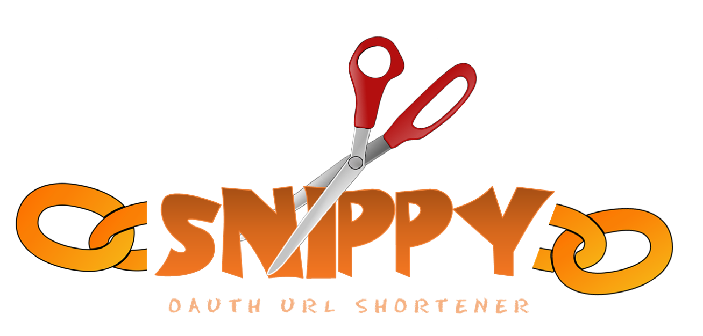

# snippy
c# URL Shortner

The goal of this project is to create a URL shortner designed to be run within a corporation using OAuth for authentication and identity management. We're also planning on using a modern JS framework for the UI - mostly as a learning excercise. 

